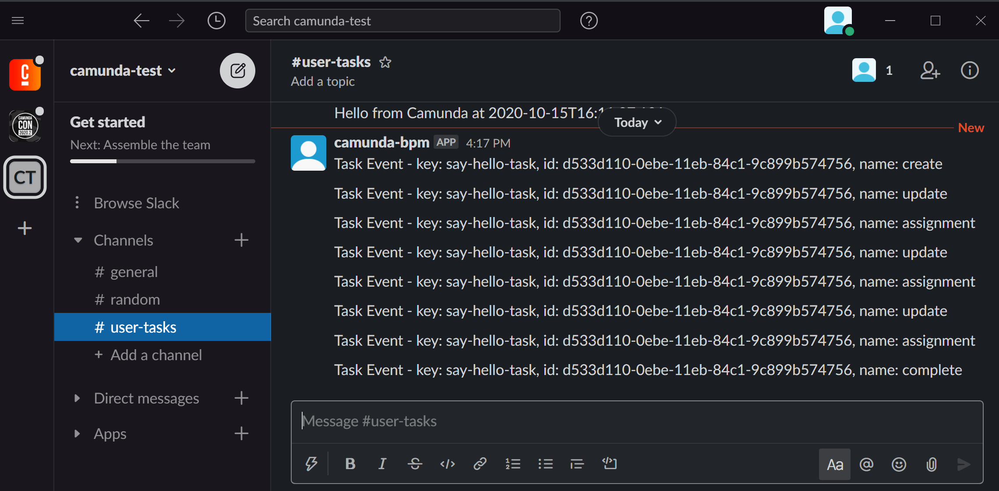

# Camunda BPM Slack Integration

This example illustrates the propagation of Camunda events via the 
[Spring event mechanism](https://docs.spring.io/spring/docs/current/spring-framework-reference/core.html#context-functionality-events) 
to a Slack channel using the Slack API Client as documented in the related [Camunda BPM documentation](https://docs.camunda.org/manual/latest/user-guide/spring-boot-integration/the-spring-event-bridge/)
and [Slack SDK for Java Documentation](https://slack.dev/java-slack-sdk/guides/web-api-basics).




## The important parts
[application.properties](src/main/resources/application.properties) enabling 
- camunda.bpm.eventing properties for task event stream
- slack oauth token and slack channel 

[Listener implementation](src/main/java/org/camunda/bpm/example/events/CamundaEventListener.java) invoked when events occur

[Slack client implementation](src/main/java/org/camunda/bpm/example/slack/SlackClient.java) invoked when events occur

### Unit Test
- [SlackClientTest](src/test/java/org/camunda/bpm/example/slack/SlackClientTest.java) quick plain Java test for your slack client setup 
- [TestSpringEvents](src/test/java/org/camunda/bpm/example/events/TestSpringEvents.java) Spring Boot test running a process, creating and publishing task events

Run in your IDE or using: 
```
mvn clean test
```

### Step through the process manually 
You can start the server using your IDE or 
```
mvn spring-boot:run
```
and step through the process manually. After the server has started you can access the Camunda tasklist via http://localhost:8080/app/tasklist.
Use the credentials *demo / demo* to login.


## License
[Apache License, Version 2.0](http://www.apache.org/licenses/LICENSE-2.0).